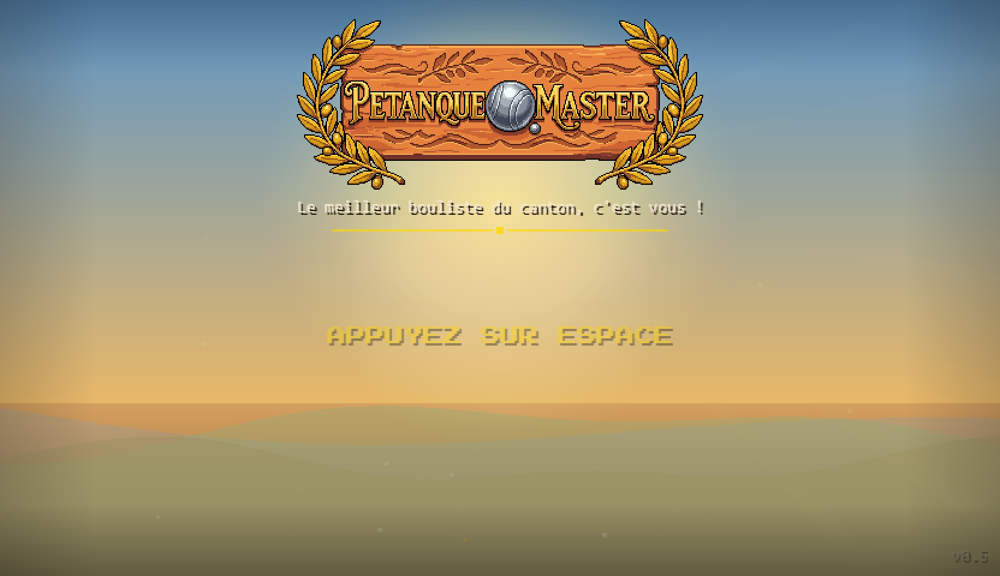
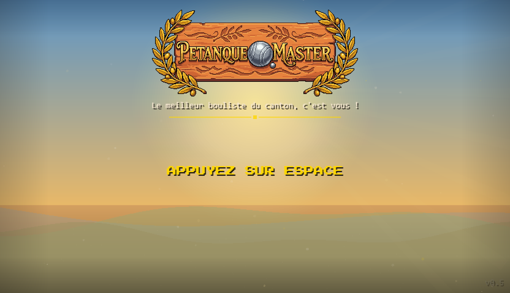

# Session du 23 mars 2026 — Sessions 9b + 10

## Chiffres
- **Commits** : 2 commits (d35b4c3, e978a25)
- **Fichiers modifiés** : 48 fichiers (875 insertions, 79 suppressions)
- **Total projet** : 221 commits, ~22k lignes JS, 556 assets PNG

## Ce qui a été fait

### Deux bugs P0 enfin tués — la partie peut se finir

Depuis des sessions, le jeu avait deux problèmes majeurs qu'on avait identifiés mais pas encore résolus :

**La boule fantôme.** Sur un terrain en pente, une boule pouvait rester "techniquement en mouvement" indéfiniment — sa vitesse tombait sous le seuil de détection mais la gravité de la pente la repoussait juste assez pour que le moteur ne la considère jamais arrêtée. Résultat : la partie se gelait, attendant une boule qui ne s'arrêterait jamais. Fix dans Ball.js : un compteur `_lowSpeedFrames` qui force l'arrêt après ~5 secondes de micro-mouvement.

**La transition bloquée.** Après la dernière mène, le jeu restait figé — pas de transition vers l'écran de résultats. L'origine était multiple : un callback qui crashait silencieusement interrompait toute la chaîne sans erreur visible. La solution est une défense en profondeur : try-catch sur chaque callback critique, deux watchdogs indépendants (12s pour les boules qui roulent, 8s pour l'état de score), et un safety timer de 5 secondes en dernier recours. En gros : si quelque chose se bloque, le jeu se débrouille tout seul pour avancer.

### Nouveaux décors pour tous les terrains

Le terrain Docks était complètement vide de décors depuis le début — ça faisait tache. Cette session, on a intégré 6 nouvelles grilles PixelLab (4×4 variantes de 64x64 chacune) : arbres top-down, touffes d'herbe, pierres éparpillées, tables de bistro, bancs de jardin, sacs de boules. Les anciens pins (grid_pin_v1/v2) ont été supprimés et remplacés par des arbres dans le bon style. Le terrain Docks a maintenant ses sacs de boules.

### Sprites QuickPlay — la grille reprend vie

Deux itérations sur l'écran de sélection des personnages :

**Problème 1** : Tous les personnages de la grille jouaient leur animation de salut en boucle, même ceux qui n'étaient pas sélectionnés. Trop d'agitation visuelle, difficile de se concentrer sur le choix.

**Solution** : Les 9 nouveaux sprites greeting PixelLab (512×128, 4 frames par personnage) s'animent maintenant uniquement sur le personnage sélectionné — le grand sprite à gauche (J1) et à droite (J2). Dans la grille, tous les personnages restent statiques (frame 0 du greeting si disponible, sinon le sprite de direction sud).

**Problème 2 (découvert en cours de route)** : Une tentative de charger les `*_animated.png` comme "portraits" individuels a échoué — ces fichiers sont des spritesheets multi-frames, pas des images uniques. La grille affichait une grille de 16 petits sprites par case. Corrigé en revenant à l'approche frame 0.

## Moments forts

- **Le watchdog qui sauve la partie** : voir le jeu se débloquer automatiquement après 12 secondes alors qu'une boule était coincée en micro-mouvement — c'est satisfaisant de voir la défense en profondeur fonctionner.
- **La grille de sélection avant/après** : avant, 12 personnages qui s'agitent tous en même temps. Après, la grille est calme et seul le personnage choisi salue le joueur. Bien plus lisible.
- **Screenshot du jeu auto-capturé** : 

## Décisions notables

- **Défense en profondeur plutôt que fix unique** : pour la transition de fin de partie, on aurait pu chercher "le" bug précis. À la place, on a ajouté des protections à chaque niveau de la chaîne. Plus robuste même si légèrement plus lourd.
- **Greeting frame 0 comme sprite statique** : utiliser le premier frame du sprite greeting comme sprite statique dans la grille garantit la cohérence visuelle — même style pixel art pour tous les personnages avec greeting.
- **`_animated.png` non exploités** : les fichiers `*_animated.png` présents dans le dossier sprites sont des spritesheets multi-frames (format 4×4 hérité), pas des portraits. Ils ne sont pas utilisés dans QuickPlay pour l'instant.

## Etat visuel

La grille de sélection est propre : 12 personnages statiques, le sélectionné s'anime. Le terrain en jeu bénéficie des nouveaux décors PixelLab.

## Avant / Après

**Avant** : Tous les personnages de la grille s'agitaient en même temps, la partie pouvait se bloquer en fin de mène sur un terrain en pente, les Docks n'avaient aucun décor.

**Après** : Grille lisible, partie qui se termine toujours (watchdogs), Docks décorés, 6 types de décors supplémentaires disponibles pour les terrains.
