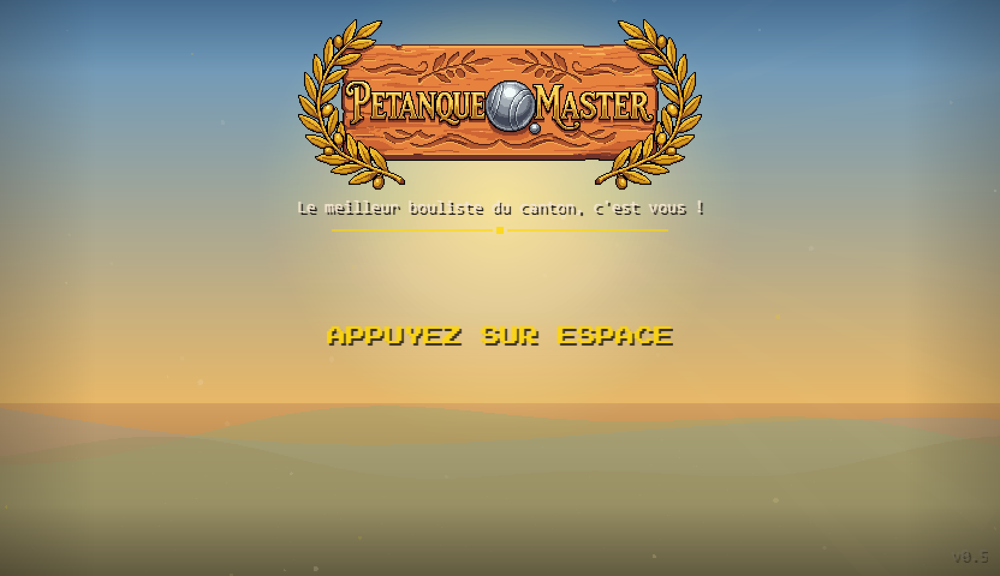

# Session du 24 mars 2026

## Chiffres
- **Commits** : 6 commits (280c092..e1bef70)
- **Fichiers modifiés** : 3 fichiers principaux (TerrainRenderer.js, terrain_editor.html, + docs)
- **Total projet** : 269 commits, ~23k lignes JS, 560 assets PNG

## Ce qui a été fait

C'est la session du **grand redesign des terrains**. Pendant la session précédente, on avait créé l'éditeur de terrain — cette fois, l'utilisateur s'en est servi pour tout redessiner à la main, terrain par terrain, et on a tout injecté en jeu.

- **Éditeur de terrain — rondins de bois** : l'éditeur ne montrait pas les bordures du terrain comme dans le jeu réel. On a ajouté les 4 bordures bois de 16px (BORDER_W=16) avec texture grain, exactement comme les rondins Phaser. Désormais ce qu'on voit dans l'éditeur = ce qu'on voit en jeu.

- **Synchronisation SCENE ↔ TERRAIN_DECOR** : le bouton "Charger scène actuelle" de l'éditeur charge maintenant les vrais layouts du jeu (et non les anciens placeholders). Workflow complet : modifier en éditeur → exporter JSON → copier-coller → injecter.

- **5 terrains redessinés** : l'utilisateur a tout refait visuellement dans l'éditeur et transmis les JSON un par un :
  - **Village** (v4) : 13 olives repositionnées, fontaine remontée, items_retro à droite, 2 bancs en haut
  - **Plage** (v2) : 4 willows (1 gauche + 3 droite), scoreboard repositionné, 10 patches de dusty_ground formant un sol sablonneux dégradé
  - **Parc** (v2) : 7 olives en colonnes, 3 bancs alignés en haut, table/sac/herbe en bas
  - **Colline** (v2) : 6 grandes olives (frame 15 — variante tronc), fontaine à droite, banc centré
  - **Docks** (v2) : 9 oliviers en rangée gauche, 4 grands oliviers droite, 14 touffes d'herbe en bordure haute

- **Depth 4.0 pour arbres devant bordure** : découverte que les sprites ont depth 0-1 mais les bordures sont à depth 3.5 — les arbres passaient derrière. Solution : `depth: 4.0` pour les olives du village qui chevauchent les rondins.

## Moments forts

- **Le moment éditeur → jeu** : voir les terrains redessinés apparaître en jeu exactement comme dans l'éditeur, sans ajustements. Le workflow fonctionne vraiment.
- **Le bug de profondeur** : l'utilisateur remarque que ses arbres passent derrière la bordure. Diagnostic rapide (border = depth 3.5, arbres = depth 0.5), solution en une ligne.
- **Plage avec dusty_ground** : 10 patches de sol sablonneux répartis hors-terrain — visuellement très réussi, ça donne l'impression d'une plage qui déborde.

## Décisions notables

- **Depth > 3.5 = "devant bordure"** : convention établie. Les sprites qui chevauchent les rondins reçoivent `depth: 4.0` explicitement (commenté dans le code). Option A choisie (manuel) plutôt qu'un checkbox dans l'éditeur.
- **Willow = image simple** (pas spritesheet) : `decor_willow` est une image unique, pas de frame, d'où l'absence de `frame:` dans plage.
- **Format JSON éditeur ↔ jeu** : les coordonnées relatives (`x:-67`, `x:'R+65'`) sont identiques dans les deux systèmes — l'éditeur exporte directement du TERRAIN_DECOR-compatible.

## État visuel

## Avant / Après

Les terrains précédents avaient des décors copiés-collés de l'ancienne session (positions approximatives). Maintenant chaque terrain a été conçu à la main avec l'éditeur visuel : les arbres encadrent le terrain, les objets racontent une histoire (la fontaine dans un coin du village, les planches de scoreboard à la plage, les herbes qui poussent le long des docks). C'est visuellement beaucoup plus riche et cohérent.
