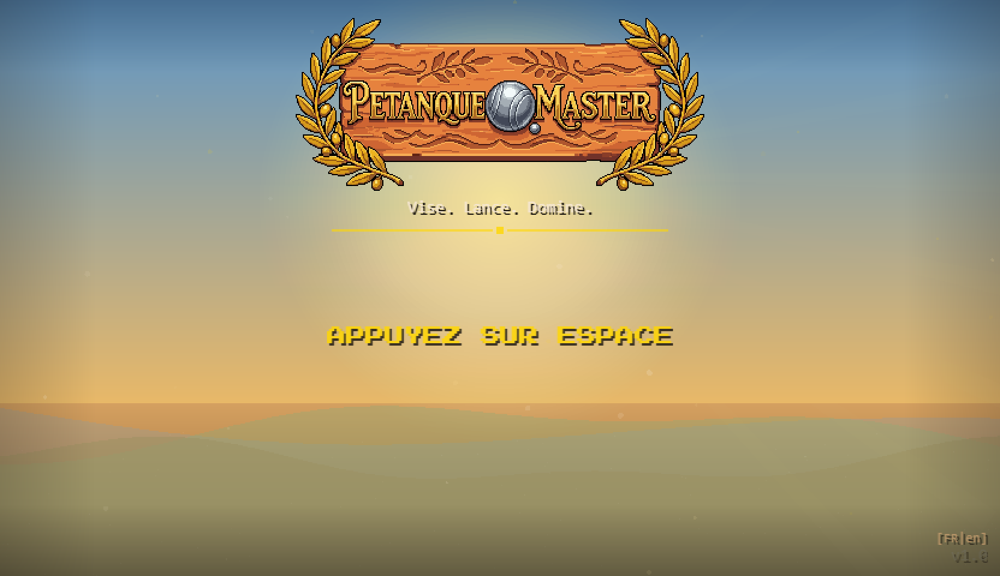
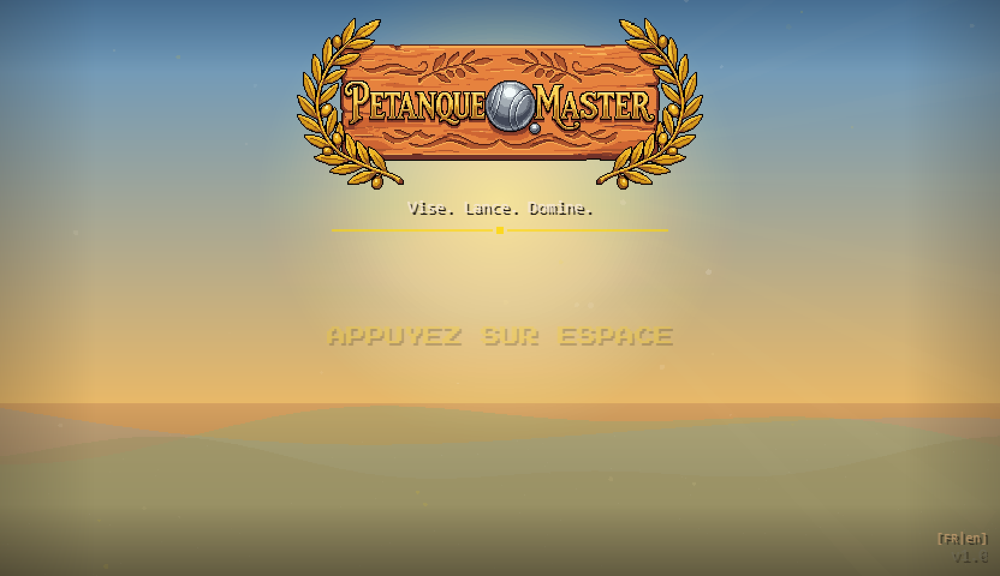

# Session du 28 mars 2026 (session 41)

## Chiffres
- **Commits** : 12 commits (40aadfa...6af93b8)
- **Fichiers modifies** : ~25 fichiers (+2100 ajouts, -300 suppressions)
- **Total projet** : 372 commits

## Ce qui a ete fait
- Refonte complete du tutoriel : le texte de la regle de petanque s'affiche au centre de l'ecran, suivi d'une animation de doigt qui montre le geste press-drag-release
- L'adversaire commence le match pendant le tuto pour que le joueur observe avant de jouer
- Cochonnet mis en valeur avec un anneau dore pulsant pendant le tutoriel
- Correction de l'ordre d'execution : le tutoriel est cree AVANT engine.startGame() pour capter les etats
- Suppression des doublons de declenchement Phase 1
- Positions des joueurs en attente definies terrain par terrain (5 terrains, coordonnees fixes evitant tous les decors)
- Grille visible sous le terrain village corrigee (remplacement tileSprite par canvas createPattern)
- Defi de mene centre au milieu de l'ecran avec animation pop-in
- Defi force toutes les 3 menes maximum
- Labels texte momentum ("ON FIRE!", "Off balance") supprimes, seul le halo colore reste
- Barks personnages supprimes pendant le tutoriel pour eviter la surcharge d'info
- Audit impacts physiques, feedback widget, error handler global
- Pipeline de lancement itch.io prepare

## Moments forts
- Le moment ou on a realise que engine.startGame() etait appele 40 lignes AVANT la creation du tutoriel — tous les etats passaient dans le vide. Un bug d'ordre d'execution classique mais frustrant a trouver.
- La creation de l'animation de doigt : un vrai mini-tutoriel visuel avec ripple, trail en pointilles, et fleche de direction. Ca remplace des paragraphes de texte.
- La definition terrain par terrain des positions de watchers : calcul des canopees d'arbres (64x64 * scale) pour trouver les zones libres. Un travail de cartographie pixel par pixel.

## Decisions notables
- **L'adversaire commence pendant le tuto** : le joueur observe d'abord comment ca se passe, puis joue quand le doigt apparait. Plus pedagogique que de lacher le joueur directement.
- **Positions watchers fixes** (pas de tracking cochonnet) : plus previsible, le joueur sait toujours ou se trouve son personnage. Chaque terrain a ses deux spots dedies.
- **Suppression des labels momentum** : l'ecran etait trop charge. Le halo colore suffit a indiquer l'etat de l'IA.
- **Tutoriel chaine lineairement** : terrain hint -> regle -> doigt -> premier lancer. Pas de triggers paralleles, pas de doublons.

## Etat visuel

## Avant / Apres
- Avant : tutoriel = bandeaux texte en haut, phases qui se chevauchent, doigt absent ou en retard
- Apres : tutoriel = panel centre avec regle, puis animation de doigt en boucle au milieu de l'ecran, timing sequentiel propre
- Avant : joueurs en attente caches derriere les arbres
- Apres : chaque terrain a deux spots dedies, toujours visibles
