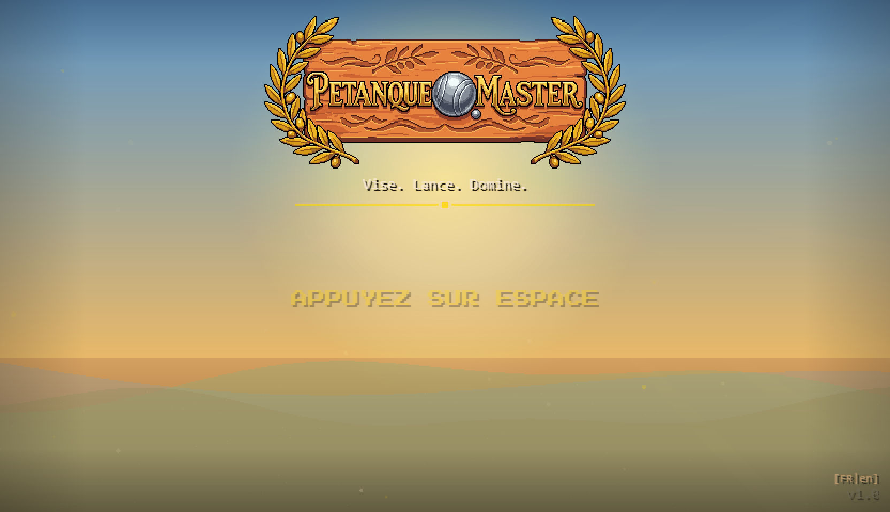

# Session du 30 mars 2026 — Session 60

## Chiffres
- **Commits** : 1 commit (3b38920)
- **Fichiers modifiés** : 3 fichiers (+41 ajouts, -18 suppressions)
- **Total projet** : 418 commits, ~726 assets PNG

## Ce qui a été fait
Session de polish chirurgical — 4 bugs UI identifiés et corrigés avant publication.

- **Bouton Back du Shop** : le bouton ne répondait plus du tout au clic après une première visite. La cause : Phaser réutilise les instances de scènes, et le flag `_transitioning` n'était jamais remis à zéro dans `init()`. La scène arrivait "bloquée" à chaque réouverture. Fix : une ligne dans `init()` + suppression d'un double-binding ESC qui créait une collision.

- **Textes superposés dans les cartes boutique** : le nom de la boule, sa description et le label "X victoires requises" (pour les items verrouillés) se chevauchaient. En cause : un décalage Y trop serré entre les lignes (le nom à `cy - 16` avec une hauteur rendue de ~16px dépassait sur la description à `cy - 2`). Réalignement à `cy - 26 / -8 / +8` pour un espacement propre.

- **Troncs d'arbres devant les feuillages** : les sprites d'arbres (olivier, saule, etc.) étaient des images uniques à une seule valeur de depth. Impossible d'avoir le bon ordre visuel `fond < tronc < feuillage`. Solution : chaque arbre est maintenant découpé en deux sprites via `setCrop` — la moitié basse (tronc) à depth D, la moitié haute (couronne/feuillage) à depth D+0.5. Le sway d'animation est synchronisé sur les deux pour qu'ils bougent ensemble.

- **Menu pause vs indicateur arcade** : le badge "Match X/5" restait visible en filigrane derrière l'overlay semi-transparent du menu pause (alpha 0.7). Les références du badge étaient des variables locales — impossible de les masquer depuis `_openPauseMenu`. Stockage en `this._arcadeBadgeBg` / `this._arcadeBadgeLabel`, avec hide/show à l'ouverture et à la fermeture du menu.

## Moments forts
- Le bug du bouton Back est un classique Phaser que CLAUDE.md prévenait explicitement ("Phaser réutilise les scènes : TOUJOURS définir init() avec reset de tous les flags") — on l'avait laissé passer. Une ligne de fix pour débloquer toute la navigation boutique.
- Le split trunk/crown pour les arbres est élégant : pas de nouveau fichier d'asset, pas de modification du JSON de terrain — juste deux `setCrop` et un `+0.5` sur la depth.

## Décisions notables
- On n'a pas sur-corrigé le layout des cartes boutique : réajustement minimal des 3 positions Y au lieu de refaire tout le layout.
- Pour le menu pause, on a choisi le `setVisible(false/true)` plutôt que d'augmenter encore la depth — plus propre et plus explicite.
- La suppression du double ESC dans `_setupInput` évite une régression future si `_transitioning` est de nouveau décalé.

## Etat visuel

## Avant / Après
- Shop : les cartes d'items lisibles sur toutes les tailles d'items (y compris les items verrouillés avec leur pastille 🔒)
- Terrains : les feuillages des oliviers et saules passent correctement devant leurs propres troncs
- Pause mode Arcade : le badge "Match X/5" disparaît proprement à l'ouverture du menu et réapparaît à la reprise
